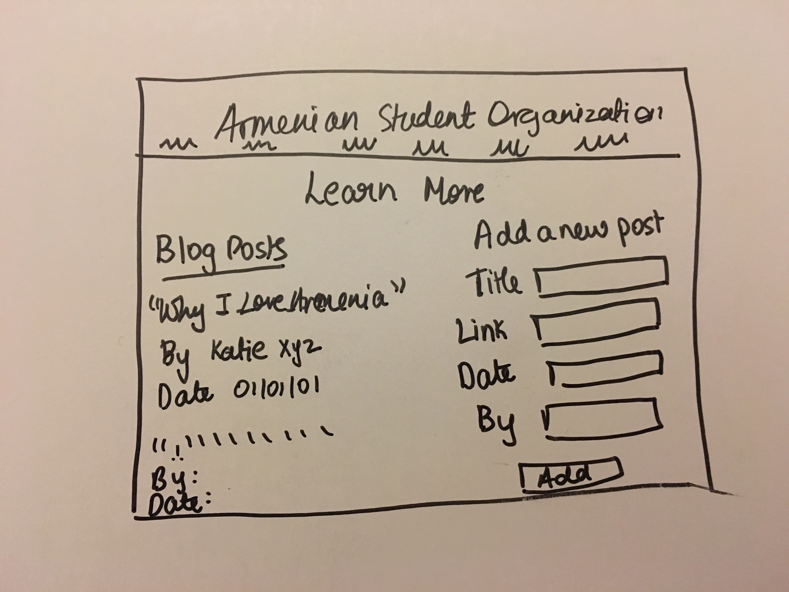
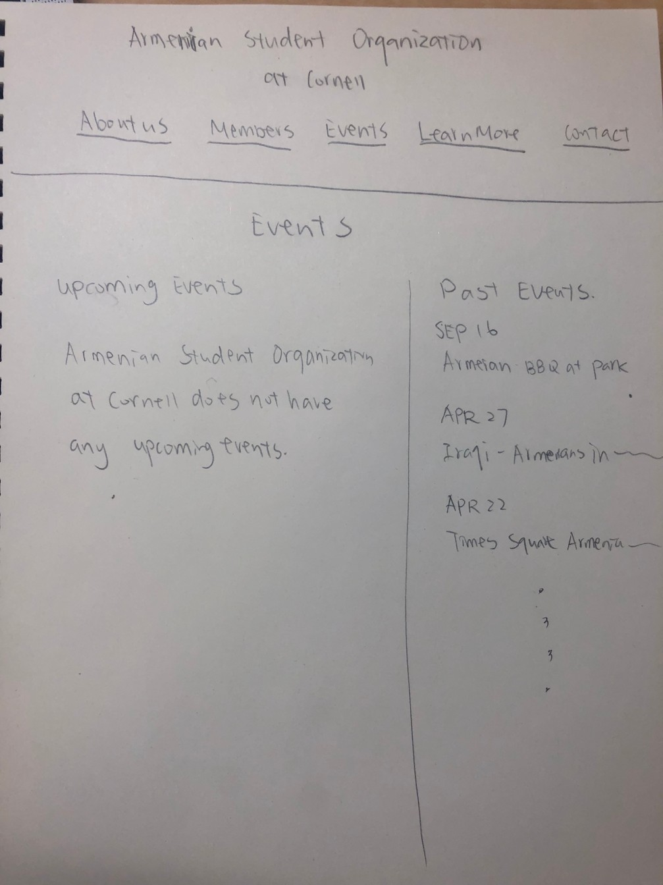
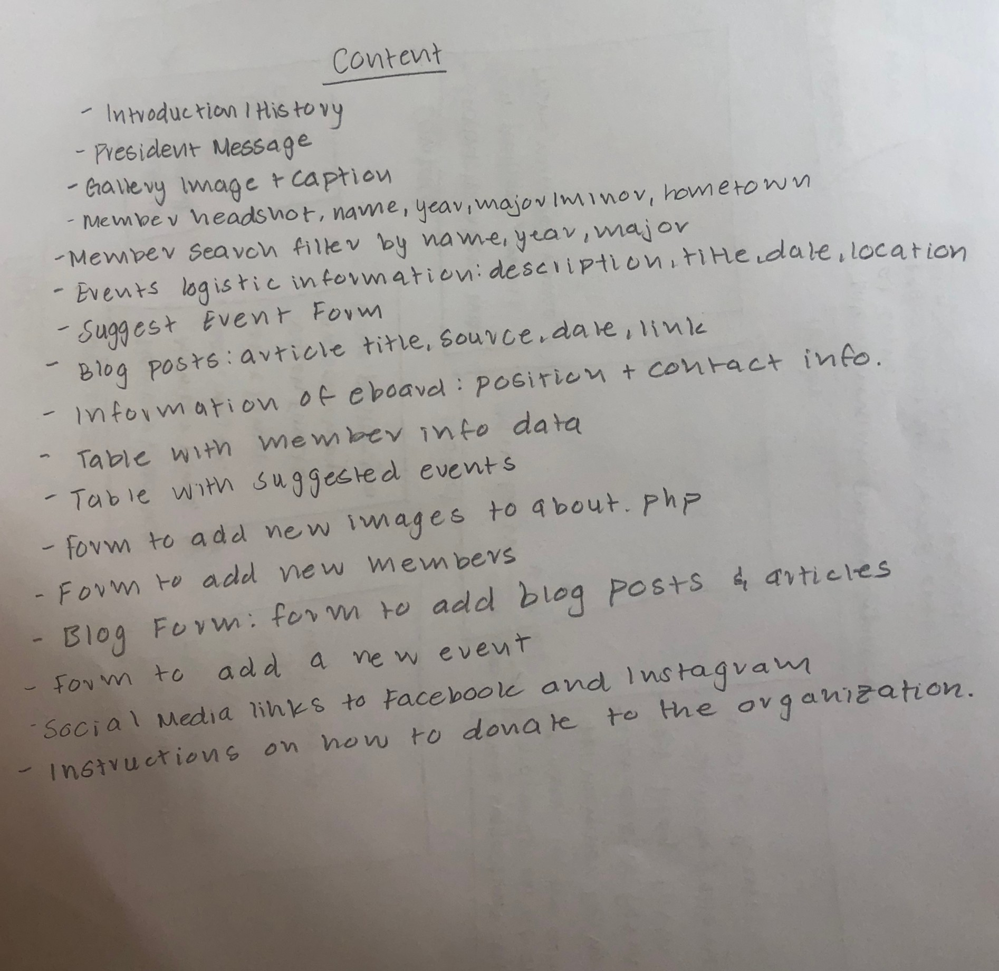
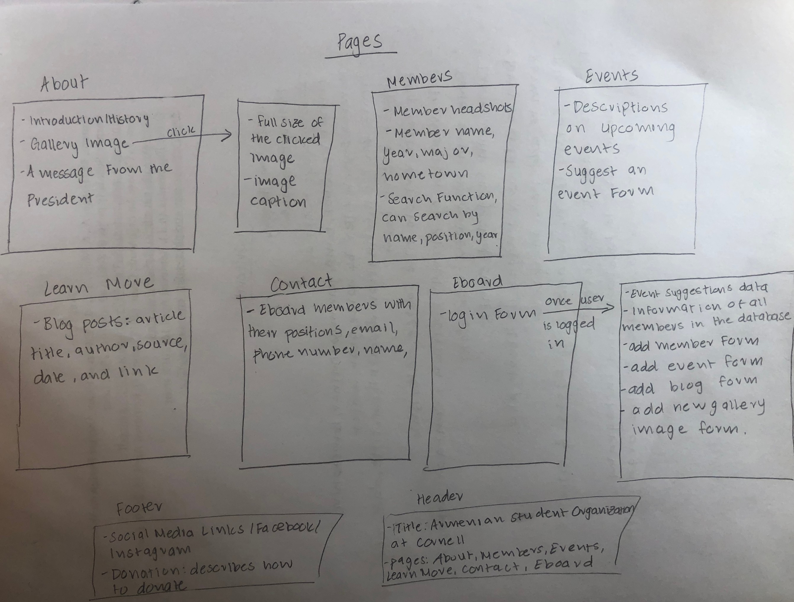

# Project 4: Design Journey

Your Team Name: [green-lion]

**All images must be visible in Markdown Preview. No credit will be provided for images in your repository that are not properly linked in Markdown. Assume all file paths are case sensitive!**


## Client Description

[Tell us about your client. Who is your client? What kind of website do they want? What are their key goals?]

> Our client is a Cornell student that is currently involved in the Armenian Student Organization on campus. Being that her organization does not have a website, she would like to have one that mainly provides further information about current members and events ongoing. Some of the key goals that she would like the website to accomplish are notifying others of future events involved with ASO, general information about current members, and to spread more awareness about ASO both on campus and in the Ithaca community.

[NOTE: If you are redesigning an existing website, give us the current URL and some screenshots of the current site. Tell us how you plan to update the site in a significant way that meets the final project requirements.]


## Meeting Notes

[By this point, you have met once with your client to discuss all their requirements. Include your notes from the meeting, an email they sent you, or whatever you used to keep track of what was discussed at the meeting. Include these artifacts here.]


 

## Purpose & Content

[Tell us the purpose of the website and what it is all about.]

> The purpose of this website is to provide one space with consolidated information about upcoming events, blog/news posts, contact information, photos, and member rosters (with bios) to both current members and others in the Cornell/Ithaca community looking to get involved. This website will mostly be about the members currently involved in ASO, and any events or news the organization would like to spread awareness about to the community.

## Target Audience(s)

[Tell us about the potential audience for this website. How, when, and where would they interact with the website? Get as much detail as possible from the client to help you find representative users.]

> The potential audience for this website will be current and potential ASO members (including staff and Ithaca community members), and other organizations looking to collaborate on events/campaigns together. An example of when users might interact with the website is when potential members visit it to gain a better understanding of the organization's goals or purpose.

## Client Requirements & Target Audiences' Needs

[Collect your client's needs and wants for the website. Come up with several appropriate design ideas on how those needs may be met. In the **Rationale** field, justify your ideas and add any additional comments you have. There is no specific number of needs required for this, but you need enough to do the job.]

Example:
- (_pick one:_) Client Requirement/Target Audience Need
  - **Requirement or Need** [What does your client and audience need or want?]
   - Client wants to cater to people who speak different languages.
  - **Design Ideas and Choices** [How will you meet those needs or wants?]
   - Create web-pages manually in multiple languages.
  - **Rationale** [Justify your decisions; additional notes.]
   - Create multiple pages in multiple languages manually.

Client Requirement/Target Audience Need
  - **Requirement or Need** [What does your client and audience need or want?]
    - Client needs to convey information about upcoming events, and blog/new posts
    - The client also wants to have member rosters with bios on the website
    - The audience also wants to find ways to get involved in the Cornell/Ithaca community by attending these events
  - **Design Ideas and Choices** [How will you meet those needs or wants?]
    - Have a login/logout function so that e-board members can edit event/blog pages
  - **Rationale** [Justify your decisions; additional notes.]
    - We can create a database of events since this seems to be a critical content for the client

## Initial Design

[Include exploratory idea sketches of your website.]





## Information Architecture, Content, and Navigation

[Lay out the plan for how you'll organize the site and which content will go where. Note any content (e.g., text, image) that you need to make/get from the client.]

[Document your process, we want to see how you came up with your content organization and website navigation.]

[Note: There is no specific amount to write here. You simply need enough content to do the job.]

Example:
- **Navigation**
  - Home
  - Portfolio
    - Websites
    - Mobile Apps
    - Tablets
  - About Me


Website:
- **Navigation**
  - About
    - Introduction/History
    - Images (Background Image)
    - Alumni in dropdown when hovered over
      - Alumni
  - Members
    - Current Members
    - Form to add members
    - Donation information
  - Events
    - Images/Descriptions
    - Form to add events
  - Learn More
    - Blog information
    - Form to add blogs/news
  - Contact
    - Information for eboard
    - Social media links


- **Content** (List all the content corresponding to main navigation and sub-categories.)
  - *Portfolio*: list all the projects (as images) this client has worked on. When the image is hovered over, display a description of the project; add a search function to enable users search for specific projects;
  - *Websites*: showcase all the websites designed by the client, with thumbnail images and a brief description for each design;
  - *Mobile Apps*: showcase all the mobile apps designed by the client, with thumbnail images and a brief description for each design;
  - *Tablets*: showcase all the tablet applications designed by the client, with thumbnail images and a brief description for each design;

- ASO website
  - *About*: Introduction to ASO using text and several images
    - *Introduction/History*: Text
    - *Images*: Images of past experiences with organization and background image of club picture
  - *Alumni*: Photo gallery including all alumni of the organization
    - *Alumni*: Separate page that is shown through a dropdown menu when hovering over "About" in the navigation bar. Picture all alumni of ASO through a similar display as the gallery webpage. Use images with captions, but most likely shorter descriptions.
  - *Members*: Photo gallery including all members of the organization
    - *Members*: Picture of every member in ASO as well as a description paired with the image
    - *Members Form*: E-board members will have the option to login and add members to the photo gallery
    - *Members Search Function*: Search by name, position, year
    - *Donation*: Bottom section of webpage describing the donation process to ASO.
  - *Events*: List of upcoming events.
    - *Images/Descriptions*: Pictures and captions of upcoming events
    - *Events Form*: E-board members will have the option to login and add upcoming events to the events gallery
  - *Learn More*: Additional information about ASO.
    - *Blog Information*: Images associated with blog titles
    - *Blog Form*: E-board members will have the option to login and add new blog information to the blog gallery that they think is important to announce/share with the community
  - *Contact*: Webpage designed to reach the organization
    - *Info of e-board*: Positions with contact information (email, phone number, name)
    - *Social Media links*: Links to social media such as Facebook or Instagram

- **Process**
  - [photo of card sort]
  
  
  


  - [explanation of how your come up with your content organization and navigation.]
  After listening to our client's requests, we came up with a list of content we wanted to add to the website.
  We then decided that it would make sense to cluster some of this content together
  * It made sense to have an About/Home page introducing ASO and its history, along with some images of the club.
  * Our client wanted member bios, so it made sense to have a separate page for members with a picture and bio for each one. With this, we needed the option to add a new member bio, so we added the form to this page (for logged in eboard members only). She also mentioned wanting a donation link, which we decided to add to this page as well, as it is mostly members' families that donate.
  * Our client wanted a list of events, so we added an Events page, in which we'll have the list of upcoming events, as well as the form to add new events (for logged in eboard members)
  * Our client wanted to display a few blog posts, so we decided to add a "Learn More" page for people interested in reading more in detail about the club. We also included the form to submit blog posts on this page.
  * We decided it would be good to have all the contact information in one place, so we're going to create a Contact page, and add to it the eboard contact info, and the social media links.
  * Thus, we ended up with our 6 main pages (About, Members, Alumni, Events, Learn More, Contact) and the information we're going to add to each one of them.


## Interactivity

[What interactive features will your site have? What PHP elements will you include?]

[Also, describe how the interactivity connects with the needs of the clients/target audience.]
We will have a login/logout function for e-board members so that they can update upcoming events and the blog. This connects with the needs of the client because one main focus of the website is to deliver information on the club's events and this also fits the needs of the audience so that they can stay up to date with the organization.

We will also include an image gallery so that the client may showcase any pictures of the events the club holds, club members, etc. This will also give the audience a visual perspective of the type of events and the community the club brings together.

We can also add a filter/search function on the members page so that if the user would like to search for a name, position, year, or major then it'll show up the corresponding data.


## Work Distribution

[Describe how each of your responsibilities will be distributed among your group members.]

[Set internal deadlines. Determine your internal dependencies. Whose task needs to be completed first in order for another person's task to be relevant? Be specific in your task descriptions so that everyone knows what needs to be done and can track the progress effectively. Consider how much time will be needed to review and integrate each other's work. Most of all, make sure that tasks are balanced across the team.]

For each milestone, we should finish our parts at least a day before the Tuesday deadline so that we can review each others' works. There is no member who is solely in charge of coding or design but instead each week we will discuss our parts so that all of us will play a part in both areas. Like we did in milestone 1, we first met up and discussed how we would split up the work evenly, and then completed each of our parts well before the deadline.

## Additional Comments

[If you feel like you haven't fully explained your design choices, or if you want to explain some other functions in your site (such as special design decisions that might not meet the final project requirements), you can use this space to justify your design choices or ask other questions about the project and process.]


--- <!-- ^^^ Milestone 1; vvv Milestone 2 -->

## Client Feedback

[Share the feedback notes you received from your client about your initial design.]


## Iterated Design

[Improve your design based on the feedback you received from your client.]


## Evaluate your Design

[Use the GenderMag method to evaluate your wireframes.]

[Pick a persona that you believe will help you address the gender bias within your design.]

I've selected **[Abby]** as my persona.

I've selected my persona because... [Tell us why you picked your persona in 1-3 sentences. Your explanation should include why your persona will help you address gender-inclusiveness bugs in your design.]

### Tasks

[You will need to evaluate at least 2 tasks (known as scenarios in the GenderMag literature). List your tasks here. These tasks are the same as the task you learned in INFO/CS 1300.]

[For each task, list the ideal set of actions that you would like your users to take when working towards the task.]

Task 1: [Abby is on the e-board for ASO, and is in charge of the initiation of new members. This past semester, there have been new members that joined ASO, which means that Abby must add those members onto the website.]

  1. [Click on the members page in the navigation bar]
  2. [Input username and password so that she is logged in]
  3. [Input all information that is required to add a new member (name, year, e-board member?, major/minor, bio)]

Task 2: [Abby is on the e-board for ASO, and has been taking the lead of planning an upcoming event hosted by ASO. To spread awareness about the event, she would like to add it to the website.]

  1. [Click on the events page in the navgiation bar]
  2. [Input username and password so that she is logged in]
  3. [Input all information that is required to add a new event]
  4. [Click on the add button to successfully add the event]


### Cognitive Walkthrough

[Perform a cognitive walkthrough using the GenderMag method for all of your Tasks. Use the GenderMag template in the <documents/gendermag-template.md> file.]

#### Task 1 - Cognitive Walkthrough

[copy the GenderMag template here and conduct a cognitive walkthrough to evaluate your design (wireframes).]

[You may need to add additional subgoals and/or actions for each task.]

# GenderMag Template

**Task name: [Add New Member]**

[Add as many subgoals as you needs]
**Subgoal # [1] : [Click members webpage]**

  - Will [Abby] have formed this sub-goal as a step to their overall goal?
    - Yes, maybe or no: [yes]
    - Why? (Especially consider [Abby]'s Motivations/Strategies.)
      > We think that due to Abby's persona of being comprehensive and her strategy of fully trying to understand what the problem is beforehand, she would be able to form this sub-goal. Because she gathers all relevant information before trying to solve a problem, forming this sub-goal for her would seem like a beginning step to achieving the overall goal.

**Action # [1A] : [Physically clicking on members webpage]**

  - Will [Abby] know what to do at this step?
    - Yes, maybe or no: [yes]
    - Why? (Especially consider [Abby]'s Knowledge/Skills, Motivations/Strategies, Self-Efficacy and Tinkering.)
      > We believe that Abby's strategy to approaching problems will ultimately allow her to reason that clicking on the members webpage is the most appropriate first action to making progress towards finishing the task.

  - If [Abby] does the right thing, will she know that she did the right thing, and is making progress towards her goal?
    - Yes, maybe or no: [yes]
    - Why? (Especially consider [persona name]'s Self-Efficacy and Attitude toward Risk.)
      > Abby will know that she did the right thing because correctly executing this action will not cause problems, instead it will do exactly what the user may think it will do, navigate to a separate page, the members webpage.

**Subgoal # [2] : [Logging in]**

  - Will [Abby] have formed this sub-goal as a step to their overall goal?
    - Yes, maybe or no: [yes]
    - Why? (Especially consider [persona name]'s Motivations/Strategies.)
      > We believe that Abby will be able to have formed this sub-goal once again due to her comprehensiveness, and her technique when learning new technologies. Because she begins with gathering all the necessary information first before tacking a problem completely, we think that she will eventually reason that she must login to progress towards the overall goal. Moreover, because she is on e-board, the short
      description at the top indicating e-board members may sign in will also give her clues to form this sub-goal. Furthermore, although she may not prefer to tinker with software, in the case that she does she will most likely stumble upon the added features of logging in based on her learning mechanisms.

**Action # [2A] : [Physically typing in username and password information]**

  - Will [Abby] know what to do at this step?
    - Yes, maybe or no: [yes]
    - Why? (Especially consider [Abby]'s Knowledge/Skills, Motivations/Strategies, Self-Efficacy and Tinkering.)
      > Once again, due to Abby's comprehensiveness, we believe that she will be able to execute this specific action. Moreover, this action is also not too complex, and does not require much computing skills other than typing in information that she should already know.

  - If [Abby] does the right thing, will she know that she did the right thing, and is making progress towards her goal?
    - Yes, maybe or no: [maybe]
    - Why? (Especially consider [persona name]'s Self-Efficacy and Attitude toward Risk.)
      > Although Abby may do the right thing, it may not be obvious at first that she did the right thing due to nothing happening after typing in the information for username and password. This is because it is only after she clicks the login button will there be a change on the screen making it more obvious that she is doing the right thing. As a result, we concluded that she may or may not be fully confident after executing this action due to her risk averse attitude and low confidence with computing tasks.

**Action # [2B] : [Physically clicking the login button]**

  - Will [Abby] know what to do at this step?
    - Yes, maybe or no: [yes]
    - Why? (Especially consider [Abby]'s Knowledge/Skills, Motivations/Strategies, Self-Efficacy and Tinkering.)
      > We believe that Abby will definitely know what to do at this step because there seems to be only one option after typing in the username and password credentials, which is clicking the login button. Again, this can be attributed to her comprehensiveness and her ability to process all the information laid out in front of her before trying to solve the problem.

  - If [Abby] does the right thing, will she know that she did the right thing, and is making progress towards her goal?
    - Yes, maybe or no: [yes]
    - Why? (Especially consider [Abby]'s Self-Efficacy and Attitude toward Risk.)
      > Abby will know that she did the right thing because clicking the login button will immediately display a change on the screen. Additionally, the newly displayed screen will also indiciate that she is logged in from the text at the top of the webpage. As a result, Abby will not blame herself because there will be no problem, and she is familiar with features that are predictable, such as clicking a login button after typing in the username and password.

**Subgoal # [3] : [Input information to add a new member]**

  - Will [Abby] have formed this sub-goal as a step to their overall goal?
    - Yes, maybe or no: [yes]
    - Why? (Especially consider [Abby]'s Motivations/Strategies.)
      > Yes, because we believe that during Abby's phase of gathering information comprehensively, she will be able reason that there must be a general format or method to add new members into the webpage.

**Action # [3A] : [Physically typing in all information of new member]**

  - Will [Abby] know what to do at this step?
    - Yes, maybe or no: [yes]
    - Why? (Especially consider [persona name]'s Knowledge/Skills, Motivations/Strategies, Self-Efficacy and Tinkering.)
      > Although Abby may not be confident in her computing skills, we think that she still would be able to complete this action because it is not too complex of a task. Moreover, Abby's comprehensive nature also allowed us to gather that she would be able to execute this action without any issues.

  - If [persona name] does the right thing, will she know that she did the right thing, and is making progress towards her goal?
    - Yes, maybe or no: [Maybe]
    - Why? (Especially consider [persona name]'s Self-Efficacy and Attitude toward Risk.)
      > Maybe, because only adding the information in without clicking the add button will not display any changes on the screen. As a result, Abby may or may not know that she did the right thing due to her risk averse attitude and unfamiliar computing skills.

**Action # [3B] : [Physically clicking add member button]**

  - Will [Abby] know what to do at this step?
    - Yes, maybe or no: [yes]
    - Why? (Especially consider [persona name]'s Knowledge/Skills, Motivations/Strategies, Self-Efficacy and Tinkering.)
      > We believe that Abby will know what to do at this step because her logical thinking should lead her to performing this action after inputting all the necessary information.

  - If [Abby] does the right thing, will she know that she did the right thing, and is making progress towards her goal?
    - Yes, maybe or no: [yes]
    - Why? (Especially consider [Abby]'s Self-Efficacy and Attitude toward Risk.)
      > Abby will know she did the right thing because clicking the add member button will transition into a new screen that contains a gallery of members with the most recent member added. Moreover, a short description confirming this action will also allow Abby to know that she did the right thing.


*Source*: Margaret Burnett, Simone Stumpf, Laura Beckwith, and Anicia Peters, "The GenderMag Kit: How to Use the GenderMag Method to Find Inclusiveness Issues through a Gender Lens", http://gendermag.org, Feb. 1 2018 .


#### Task 2 - Cognitive Walkthrough

Task 2: [Abby is on the e-board for ASO, and has been taking the lead of planning an upcoming event hosted by ASO. To spread awareness about the event, she would like to add it to the website.]

**Subgoal # [1] : [Find events page]**

  - Will [persona name] have formed this sub-goal as a step to their overall goal?
    - Yes, maybe or no: [Yes]
    - Why? (Especially consider [Abby]'s Motivations/Strategies.)
    Abby has the task in mind to add in events so intuitively she would form a goal to navigate to a page where she could see information on the events. She would be able to form this goal since she is a logical thinker and it is logical to navigate to a page of related content.

**Action # [1] : [Click on the events page in the navgiation bar]**

    - Will [persona name] know what to do at this step?
    - Yes, maybe or no: [yes]
    - Why? (Especially consider [persona name]'s Knowledge/Skills, Motivations/Strategies, Self-Efficacy and Tinkering.)

    Why? (Especially consider [persona]'s Knowledge/Skills, Motivations/Strategies, Self-Efficacy and Tinkering.)
    Abby is a comprehensive learner and is also logical based so she will read what pages are on the nav bar and reason that the page to add in events would possibly be under the events webpage.

    - If [Abby] does the right thing, will she know that she did the right thing, and is making progress towards her goal?
    - Yes, maybe or no: [yes]
    - Why? (Especially consider [Abby]'s Self-Efficacy and Attitude toward Risk.)
    Abby will see that she has gone to a page that have relevant information on events and see the log in form that can lead her into being able to add in events onto the page.

  **Action # [2] : [Input username and password so that she is logged in]**

    - Will [persona name] know what to do at this step?
    - Yes, maybe or no: [yes]
    - Why? (Especially consider [persona name]'s Knowledge/Skills, Motivations/Strategies, Self-Efficacy and Tinkering.)

    Abby will read what is on the page. Since the log in is designed to be at the top of the page, Abby could see that there is a section for her to be able to log in with a username and password to submit the form.

    - If [Abby] does the right thing, will she know that she did the right thing, and is making progress towards her goal?
    - Yes, maybe or no: [yes]
    - Why? (Especially consider [Abby]'s Self-Efficacy and Attitude toward Risk.)

    Abby will see that she has logged in and this should permit her to be able to update events.

  **Subgoal # [2] : [Add in the event onto the website]**

  - Will [persona name] have formed this sub-goal as a step to their overall goal?
    - Yes, maybe or no: [yes]
    - Why? (Especially consider [Abby]'s Motivations/Strategies.)
    She would form this sub goal because once she has completed the first sub goal she should see a page where she is logged in and is permitted to see a form which has the purpose of adding an event. Since she is the type of person to read through information before tinkering, she would naturally see that at the top of the page (clearly visible) that now her step is to add in the event that she has been planning and to input all the relevant information.

**Action # [1] : [Input all information that is required to add a new event]**

    - Will [persona name] know what to do at this step?
    - Yes, maybe or no: [yes]
    - Why? (Especially consider [persona name]'s Knowledge/Skills, Motivations/Strategies, Self-Efficacy and Tinkering.)

    Abby should see a form section at the top of the page when logged in. Since Abby is the type of person to gather information to understand the task, Abby would read through the form of all the questions, (add button) to understand that she would have to complete the form by inserting information to add events.

    - If [Abby] does the right thing, will she know that she did the right thing, and is making progress towards her goal?
    - Yes, maybe or no: [yes]
    - Why? (Especially consider [Abby]'s Self-Efficacy and Attitude toward Risk.)

    Abby will see that she is a step closer to accomplishing the task because then she'll see that all the information that she wants to relay to the audience is being placed in a form that will allow her to display the information on the webpage.
**Action # [2] : [Click on the add button to successfully add the event]**

    - Will [persona name] know what to do at this step?
    - Yes, maybe or no: [yes]
    - Why? (Especially consider [persona name]'s Knowledge/Skills, Motivations/Strategies, Self-Efficacy and Tinkering.)

    Abby would read through the information and buttons asked on the form and would see that at the end of the form is the add button. Intuitively she would click the add button to send in all the information that she placed.

    - If [Abby] does the right thing, will she know that she did the right thing, and is making progress towards her goal?
    - Yes, maybe or no: [yes/]
    - Why? (Especially consider [Abby]'s Self-Efficacy and Attitude toward Risk.)

    Abby will see that she has added an event to the page because once she presses the add button, she should still be on the events page and would see that the event that she inserted was directly updated and displayed on the page.


### Cognitive Walk-though Results

[Did you discover any issues with your design? What were they? How will you change your design to address the gender-inclusiveness bugs you discovered?]

[Your responses here should be **very** thorough and thoughtful.]
- Members page
  - We discovered that after a user is logged, we forgot to add a button to physically add a new member, which would completely defeat the whole purpose of a form to add members. As a result, we will simply include a button that visibly noticable for users to click after typing in all necessary information to add a new member. Moreover, another issue that we noticed was that we didn't include a feature to remove members. This is an issue because members that disaffiliate with the organization, or become alumni should not be included in the members webpage anymore. To solve this issue, we will include a delete feature that is visible only when the logged in user clicks on the image of the member.

- Events page
  - After going through a cognitive walk-through with our events page, we noticed a few issues with our design. These issues consisted of a missing login section, which in turn does not allow users to add or delete events. As a result, implementing a delete functionality would allow us to get rid of the past events section since users can simply delete specific events.

## Final Design

[Include sketches of your finalized design.]

[What changes did you make to your final design based on the results on your cognitive walkthrough?]


## Database Schema

[Describe the structure of your database. You may use words or a picture. A bulleted list is probably the simplest way to do this.]

Table: members
* field 1: id (PK)
* field 2: user_id (INTEGER)
* field 3: name (TEXT NOT NULL)
* field 4: year (INTEGER NOT NULL)
* field 5: eboard (BOOLEAN NOT NULL)
* field 6: alumni (BOOLEAN NOT NULL)
* field 7: major (TEXT)
* field 8: minor (TEXT)
* field 9: bio (TEXT)

Table: events
* field 1: id (PK)
* field 2: file_name (TEXT)
* field 3: file_ext (TEXT)
* field 4: event_name (TEXT)
* field 5: description (TEXT)
* field 6: time (TEXT)
* field 7: location (TEXT)

Table: blog
* field 1: id (PK)
* field 2: title (TEXT NOT NULL)
* field 3: link (TEXT NOT NULL)
* field 4: date (TEXT NOT NULL)
* field 5: author (TEXT NOT NULL)

Table: users
* field 1: id (PK)
* field 2: username (TEXT NOT NULL)
* field 3: password (TEXT NOT NULL)

## Database Queries

[Plan your database queries. You may use natural language, pseudocode, or SQL.]


## PHP File Structure

[List the PHP files you will have. You will probably want to do this with a bulleted list.]

* index.php - main page.
* includes/init.php - stuff that useful for every web page.
* events.php
* eventsingle.php
* member.php
* membersingle.php
* learn.php
* contact.php
* alumni.php


## Pseudocode

[For each PHP file, plan out your pseudocode. You probably want a subheading for each file.]

### index.php

```
Pseudocode for index.php...

include init.php

TODO
```


## Additional Comments

[Add any additional comments you have here.]


--- <!-- ^^^ Milestone 2; vvv Milestone 3 -->

## Issues & Challenges

[Tell us about any issues or challenges you faced while trying to complete milestone 3. Bullet points preferred.]


--- <!-- ^^^ Milestone 3; vvv FINAL SUBMISSION-->

## Final Notes to the Clients

[Include any other information that your client needs to know about your final website design. For example, what client wants or needs were unable to be realized in your final product? Why were you unable to meet those wants/needs?]


## Final Notes to the Graders

[1. Give us three specific strengths of your site that sets it apart from the previous website of the client (if applicable) and/or from other websites. Think of this as your chance to argue for the things you did really well.]

[2. Tell us about things that don't work, what you wanted to implement, or what you would do if you keep working with the client in the future. Give justifications.]

[3. Tell us anything else you need us to know for when we're looking at the project.]
